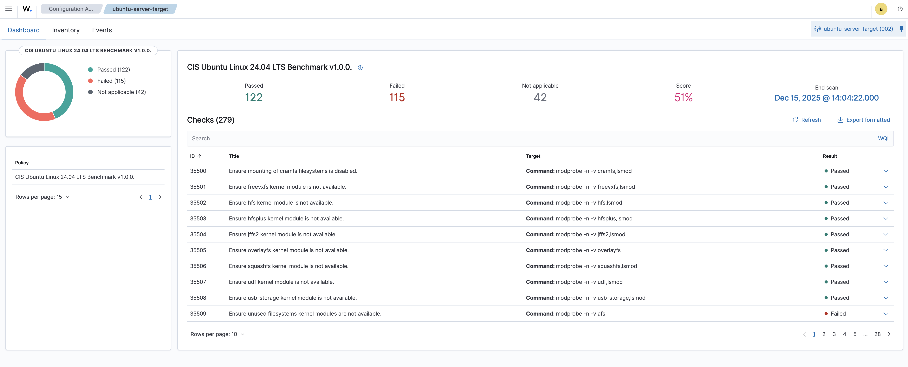
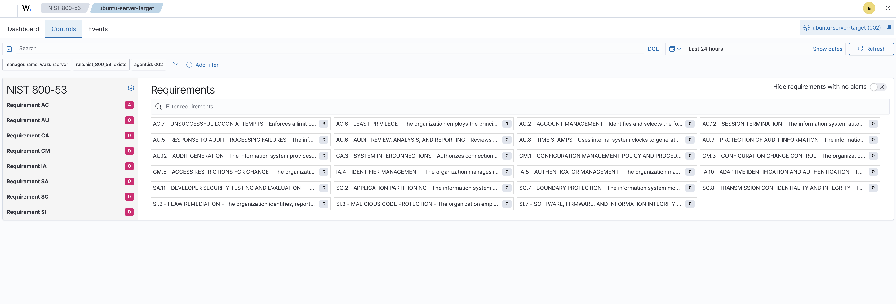

# Wazuh GRC Compliance Lab

## Overview

This project demonstrates a compliance assessment workflow using Wazuh SIEM to evaluate Linux endpoint security against CIS benchmarks and NIST 800-53 controls. The lab includes running Security Configuration Assessment (SCA) scans, analyzing findings by control category, mapping results to compliance frameworks, and producing a professional compliance report.

## Environment

| Component | Details |
|-----------|---------|
| SIEM Platform | Wazuh 4.x |
| Target System | Ubuntu Linux 24.04 LTS Server |
| Benchmark | CIS Ubuntu Linux 24.04 LTS Benchmark v1.0.0 |
| Assessment Type | Security Configuration Assessment (SCA) |

## Assessment Results

| Metric | Value |
|--------|-------|
| Total Checks | 279 |
| Passed | 122 |
| Failed | 115 |
| Not Applicable | 42 |
| Compliance Score | 51% |

### SCA Dashboard


### NIST 800-53 Compliance Dashboard


### Findings by Category

- **Network Security**: 20 failed checks (firewall policies, kernel modules, network protocols)
- **Authentication & Access Control**: 42 failed checks (SSH hardening, password policies, cron permissions)
- **Logging & Auditing**: 25 failed checks (audit rules, log partitioning, warning banners)

### Filtered for Failed


## Work Performed

### 1. Configured SCA Module on Wazuh Agent
Verified and enabled the Wazuh agent configuration (`/var/ossec/etc/ossec.conf`) for Security Configuration Assessment scanning:

```xml
<sca>
    <enabled>yes</enabled>
    <scan_on_start>yes</scan_on_start>
    <interval>12h</interval>
    <skip_nfs>yes</skip_nfs>
</sca>
```

### 2. Executed Compliance Scan and Verified Results
Restarted the Wazuh agent to trigger the SCA scan and confirmed successful execution via log analysis:

```bash
sudo systemctl restart wazuh-agent
sudo cat /var/ossec/logs/ossec.log | grep -i sca
```

Output confirmed:
```
sca: INFO: Loaded policy '/var/ossec/ruleset/sca/cis_ubuntu24-04.yml'
sca: INFO: Starting evaluation of policy...
sca: INFO: Security Configuration Assessment scan finished.
```

### 3. Analyzed Findings in Wazuh Dashboard
Navigated the Wazuh dashboard to review:
- Configuration Assessment module for pass/fail breakdown
- Individual check details including rationale and remediation steps
- NIST 800-53 compliance dashboard showing alerts mapped to control families (AU, AC, SI, CM)

### 4. Exported and Categorized Scan Data
Exported all 279 checks to CSV and filtered findings into categories:
- Network security controls (firewall, kernel modules, network services)
- Authentication controls (SSH, password, cron, sudo)
- Logging controls (auditd, journald, syslog, partitions)

### 5. Mapped Findings to Compliance Frameworks
Reviewed compliance tags on each finding to document framework coverage:

| Framework | Relevant Controls |
|-----------|-------------------|
| NIST 800-53 | AC-5, AC-6, AU-7, CM-6, SI-7 |
| PCI DSS v4.0 | 1.2.5, 2.2.4, 5.3.4, 6.4.1, 7.1, 10.2.1 |
| HIPAA | 164.308(a)(3), 164.312(a)(1), 164.312(b) |
| SOC 2 | CC5.2, CC6.1, CC6.3, CC6.6, A1.1 |
| CMMC v2.0 | AC.L1-3.1.1, CM.L2-3.4.7, AU.L2-3.3.1 |

### 6. Produced Compliance Report
Generated a professional compliance report documenting:
- Executive summary with assessment scope
- Findings organized by control category
- Framework mapping for each finding
- Prioritized remediation recommendations

📄 **[View Full Compliance Report](reports/CIS_Compliance_Report.pdf)**

## Sample Findings

### High Priority - Network Security
| ID | Finding | Status |
|----|---------|--------|
| 35619 | Ensure a single firewall configuration utility is in use | Failed |
| 35624 | Ensure ufw default deny firewall policy | Failed |
| 35604 | Ensure dccp kernel module is not available | Failed |

### High Priority - Authentication
| ID | Finding | Status |
|----|---------|--------|
| 35665 | Ensure sshd PermitRootLogin is disabled | Failed |
| 35671 | Ensure sshd MaxAuthTries is configured | Failed |
| 35677 | Ensure sshd ClientAliveInterval and ClientAliveCountMax are configured | Failed |

### Medium Priority - Logging
| ID | Finding | Status |
|----|---------|--------|
| 35528 | Ensure separate partition exists for /var/log | Failed |
| 35641 | Ensure audit logs are not automatically deleted | Failed |
| 35649 | Ensure audit configuration is immutable | Failed |


```

## Tools Used

- **Wazuh SIEM** - Open source security monitoring platform
- **Wazuh SCA Module** - Security Configuration Assessment for CIS benchmarks
- **CIS Benchmarks** - Industry-standard security configuration guidelines

## References

- [NIST SP 800-53 Rev 5](https://csrc.nist.gov/publications/detail/sp/800-53/rev-5/final)
- [CIS Benchmarks](https://www.cisecurity.org/cis-benchmarks)
- [Wazuh SCA Documentation](https://documentation.wazuh.com/current/user-manual/capabilities/sec-config-assessment/index.html)

---

*This lab was created as part of a cybersecurity portfolio demonstrating GRC and compliance monitoring capabilities.*
